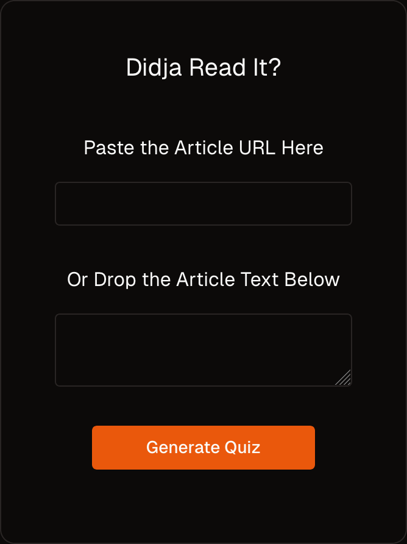

# Didja? - AI-Powered Reading Comprehension Quiz Generator

Didja is an intelligent quiz generation tool that helps you test and improve your understanding of any article or text content. Simply paste a URL or text, and get instant multiple-choice questions to test your comprehension.

## 🚀 [Try the Live Demo](https://didja.vercel.app/)

<p align="center">
  
</p>

## Features

- 🤖 AI-powered quiz generation using GPT-4
- 📝 Support for both URL and direct text input
- ✨ Clean, modern UI built with Next.js 15 and React 19
- 🎯 Instant feedback on quiz performance
- 🌙 Dark mode by default

## Getting Started

### Prerequisites

- Node.js 18.18 or higher
- npm or yarn
- OpenAI API key

### Installation

1. Clone the repository

```bash
git clone git@github.com:obasilakis/didja.git
```

2. Navigate to the project directory
```bash
cd didja
```

3. Install dependencies
```bash
npm install
```

4. Create a `.env` file in the root directory and add your OpenAI API key:
```bash
OPENAI_API_KEY=your_api_key_here
```

5. Start the development server
```bash
npm run dev
```

6. Open [http://localhost:3000](http://localhost:3000) in your browser

## Tech Stack

- [Next.js 15](https://nextjs.org/) - React framework
- [Tailwind CSS](https://tailwindcss.com/) - Styling
- [shadcn/ui](https://ui.shadcn.com/) - UI components
- [OpenAI API](https://openai.com/) - Quiz generation
- [TypeScript](https://www.typescriptlang.org/) - Type safety

## Roadmap

### Authentication & Progress Tracking
- [ ] Implement NextAuth.js for user authentication
- [ ] Set up PostgreSQL database with TypeORM
- [ ] Add user profile and quiz history
- [ ] Add charts for progress tracking over time

### Enhanced Content Support
- [ ] Add YouTube video transcript support
- [ ] Generate summaries alongside quizzes
- [ ] Support PDF document uploads
- [ ] Add support for multiple languages

### AI Improvements
- [ ] Implement an AI agent to verify question quality
- [ ] Add difficulty levels for questions
- [ ] Generate explanations for correct answers

## Contributing

Contributions are welcome! Please feel free to open an issue or submit a Pull Request.

## License

This project is licensed under the MIT License - see the [LICENSE](LICENSE) file for details.

## Acknowledgments

- Built with [create-next-app](https://nextjs.org/docs/api-reference/create-next-app)
- UI components from [shadcn/ui](https://ui.shadcn.com/)
- Powered by [OpenAI](https://openai.com/)